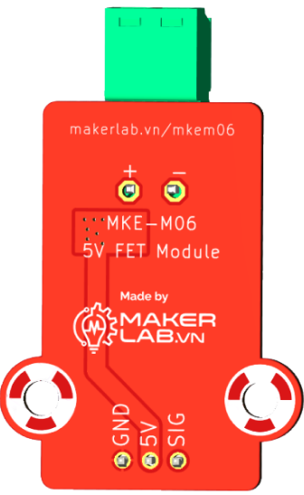
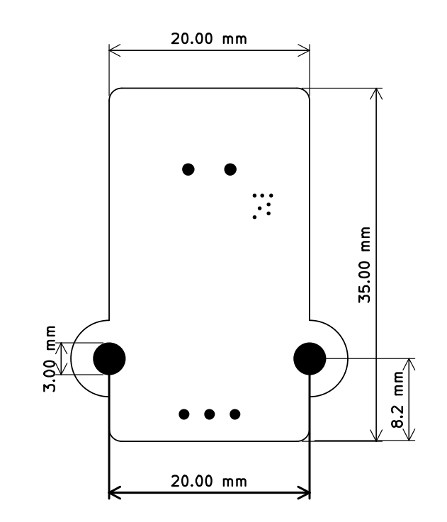

# Mạch đóng ngắt tải MKE-M06-5V-Fet-Module 

## Giới thiệu

Mạch đóng ngắt tải MKE-M06-5V-Fet-Module  được sử dụng như một mạch công suất mosfet được điều khiển bằng tín hiệu từ mạch điều khiển, mạch có thể đóng ngắt dòng điện, tín hiệu điện một chiều (DC), mạch được thiết kế để điều khiển bật tắt đèn LED công suất, quạt hoặc động cơ bơm,...

Mạch đóng ngắt tải MKE-M06-5V-Fet-Module  thuộc hệ sinh thái phần cứng Robotics MakerEdu nên có thể sử dụng trực tiếp an toàn với các mạch điều khiển trung tâm ở cả hai mức điện áp 3.3VDC và 5VDC như: Arduino, Raspberry Pi, Jetson Nano, Micro:bit,....với chuẩn kết nối Connector XH2.54 thông dụng.

## Nguyên lý hoạt động

Mạch hoạt động như một công tắc điện tử. Khi điều khiển bằng Arduino, người dùng chỉ cần sử dụng chân tín hiệu số Digital từ một chân của Arduino(vi điều khiển) để bật tắt mosfet trên mạch. 

## Thông số kỹ thuật

- Điện áp hoạt động: 5VDC
- Chuẩn giao tiếp: Digital
- Điện áp giao tiếp: TTL 3.3VDC 
- Công suất chịu tải : 5V-2A:
- Sử dụng trực tiếp an toàn với các mạch điều khiển trung tâm giao tiếp ở cả hai mức điện áp 3.3VDC và 5VDC như: Arduino, Raspberry Pi, Jetson Nano, Micro:bit,....
- Chuẩn kết nối: connector XH2.54 3Pins
- Thuộc hệ sinh thái phần cứng Robotics MakerEdu, tương thích tốt nhất khi sử dụng với các mạch điều khiển trung tâm của MakerEdu và MakerEdu Shield.

## Kích thước

## Các chân tín hiệu

<table><thead>
  <tr>
    <th>MKE-M05</th>
    <th>Ghi chú</th>
  </tr></thead>
<tbody>
  <tr>
    <td>GND</td>
    <td>Chân cấp nguồn âm 0VDC</td>
  </tr>
  <tr>
    <td>5V</td>
    <td>Chân cấp nguồn dương 5VDC</td>
  </tr>
  <tr>
    <td>SIG</td>
    <td>Chân tín hiệu Digital In</td>
  </tr>
  <tr>
    <td>(+)</td>
    <td>Cổng kết nối chân nguồn dương OUTPUT (+) </td>
  </tr>
  <tr>
    <td>(-)</td>
    <td>Cổng kết nối chân nguồn âm OUTPUT(-)</td>
  </tr>
  <tr>
  
  </tr>
</tbody>
</table>

<table><thead>
  <tr>
    <th>SIG (Digital In)</th>
    <th>Trạng thái</th>
  </tr></thead>
<tbody>
  <tr>
    <td>TTL HIGH</td>
    <td> Hoạt động (ON)</td>
  </tr>
  <tr>
    <td>TTL LOW</td>
    <td>Không hoạt động (OFF)</td>
  </tr>
</tbody>
</table>

## Hướng dẫn sử dụng

### Các thiết bị sử dụng trong bài hướng dẫn

#### Arduino

- [Mạch Vietduino Uno (Arduino Uno Compatible)](https://www.makerlab.vn/vuno)
- [Mạch MakerEdu Shield for Vietduino](https://www.makerlab.vn/vietduinosd)
- [Mạch biến trở MKE-M04 potentiometer module](https://github.com/productmakerlabvn/MKE-M04-Potentiometer-Module)
- [Mạch nút nhấn MKE-M02 push button tact switch module](https://www.makerlab.vn/mkem02)
- [Động cơ bơm chìm Mini Water Pump 5VDC](https://hshop.vn/dong-co-bom-chim-mini-5vdc)

<!-- 
#### mBlock

- [Mạch MakerEdu Creator (Arduino Uno Compatible)](https://www.makerlab.vn/creator)
- [Mạch màn hình MKE-M07 LCD1602 I2C Display Module](https://www.makerlab.vn/mkem07)
- [Mạch nút nhấn MKE-M02 push button tact switch module](https://www.makerlab.vn/mkem02)

#### Micro:bit:

- [Mạch Micro:bit V2](https://hshop.vn/products/kit-hoc-lap-trinh-stem-cho-tre-em-micro-bit-v2) hoặc các phiên bản tương thích.
- [Mạch MakerEdu Shield for Micro:bit](https://www.makerlab.vn/microbitsd)
- [Mạch màn hình MKE-M07 LCD1602 I2C Display Module](https://www.makerlab.vn/mkem07)
- [Mạch nút nhấn MKE-M02 push button tact switch module](https://www.makerlab.vn/mkem02) -->
[Hướng dẫn cài đặt phần mềm, nạp chương trình, cài đặt bộ thư viện Arduino cơ bản.](https://github.com/makerlabvn/Arduino-Vietduino)
- Tải và cài đặt [phần mềm Arduino tại đây.](https://www.arduino.cc/en/software)
### Hướng dẫn sử dụng điều khiển bật tắt bơm chìm mini bằng button
- sơ đồ kết nối

- [Tải chương trình mẫu tại đây](arduino/MKE_M06_Button_Control/MKE_M06_Button_Control.ino)

### Hướng dẫn cấp xung PWM điều khiển tốc độ động cơ 
- Sơ đồ kết nối

- [Tải chương trình mẫu tại đây](<arduino/MKE_M06_PWM_Control copy/MKE_M06_PWM_Control.ino>)

## Hỗ trợ và liên hệ

- Website: [https://www.makerlab.vn/](https://www.makerlab.vn/)
- Facebook: [https://www.facebook.com/makerlabvn](https://www.facebook.com/makerlabvn)

## Nhà phân phối

- Các bạn có thể mua sản phẩm của MakerLab tại các [Nhà Phân Phối.](https://www.makerlab.vn/distributor/)
